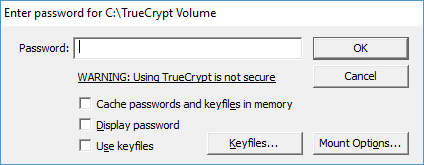

# TrueCrypt Password Breaker 

## Overview 

This project provides a password breaker to perform a semi-brute force analysis against TrueCrypt volumes for which you have forgotten the password, but know pieces of the password. 

This is helpful when you have old TrueCrypt volumes you need to migrate, but you don't remember the password. You know that your passwords at that time were usually some combination of a given set of words and characters, but you don't remember the exact combination. 

## Requirements 

1. TrueCrypt installed 
2. Python 3.4 or higher 
3. Python UIAutomation packaged 

    `pip install uiautomation`

4. A TrueCrypt volume 

## Setting Up 

In `pythonUIAuto.py`, update the `pieces` array to include the known set of password pieces you wish to try. 

Note that this list must contain every word or character that will be in the resultant password. 

## Getting Started 

Open your TrueCrypt volume, and mount the volume to an open drive. You should see the password prompt dialogue:

Once this dialogue is ready, you should run:

`python .\pythonUIAuto.py`

Once execution begins, you will have 3 seconds to place your cursor focus into the password field on the password prompt. After 3 seconds, python will begin guessing your password through the UI. 

Note: you must leave the cursor focus in the password prompt the entire time the python script is running. It is recommended to leave this script running while you are not using your machine. 